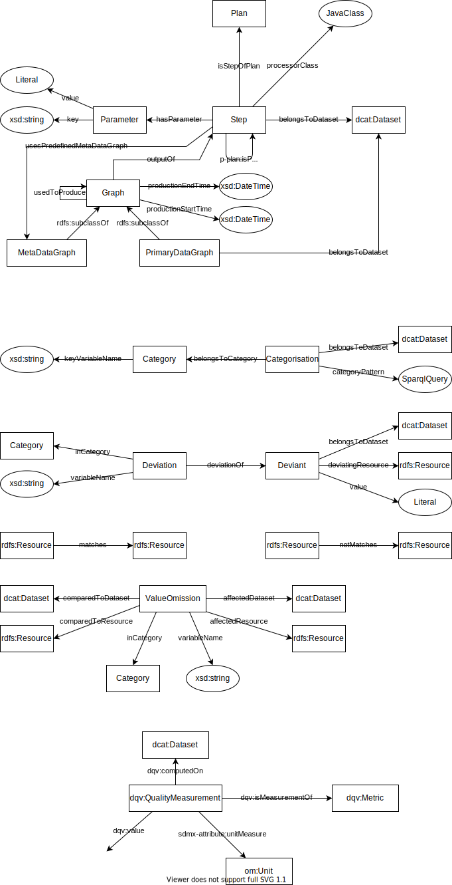

# The ABECTO Vocabulary

The ABECTO Vocabulary (AV) is vocabulary for the description of execution plans and results of the [ABox Evaluation and Comparison Tool for Ontologies (ABECTO)](https://github.com/fusion-jena/abecto). It reuses …

## Scope of the Vocabulary

The vocabulary is designed to cover the following competency questions.

### Execution Plan

* What are the steps of an execution plan and which steps follow each other in which sequence?
* What is the Java class executing a step, what are their call parameters and which predefined meta data graph will be used?
* To which dataset will resulting primary data of a step belong?
* To which dataset belong some primary data?
* Which step produced some meta data or primary data in which time interval and which other data have been used to produces them?

### Categories / Scopes / Domains

*"Category" also used for groups of Quality Dimensions*

* 

### Resource Correspondence / Mapping

* Which resources of which dataset correspond to each other?
* Which resources of which dataset are known to not correspond to each other

### Quality Data

* What object property or data property values of which resource in a dataset are known to be wrong?
* What data property values of which corresponding resources of two dataset deviate?
* What object property values of which corresponding resources in a category of two datasets do not correspond to each other?
* Which further issues have been found for a dataset?
* For which resources in a dataset does no corresponding resource exist in another dataset?
* Which measurements have been measured for a dataset with which parameters?

## Model



### Related Vocabularies (Re-Use Candidates)

* Ontology Quality
    * dqv 	http://www.w3.org/ns/dqv#    https://www.w3.org/ns/dqv.ttl   https://www.w3.org/TR/vocab-dqv/
    * daq 	http://purl.org/eis/vocab/daq#
    * dcat 	http://www.w3.org/ns/dcat#
    * dcterms 	http://purl.org/dc/terms/
    * duv 	http://www.w3.org/ns/duv#
    * oa 	http://www.w3.org/ns/oa#
    * prov 	http://www.w3.org/ns/prov#
    * sdmx-attribute 	http://purl.org/linked-data/sdmx/2009/attribute#
    * skos 	http://www.w3.org/2004/02/skos/core#
* Ontology Mapping
    * https://moex.gitlabpages.inria.fr/alignapi/format.html
* Categories
     * http://www.linkedmodel.org/schema/vaem#Domain
     * http://purl.org/cwmo/#KnowledgeDomain

Pipelines / Processes
* CTRLont   https://technicalbuildingsystems.github.io/Ontologies/CTRLont/index-en.html
* Machine Learning Schema   http://www.w3.org/ns/mls
* http://ontologydesignpatterns.org/wiki/Community:Workflow
* P-Plan     http://vocab.linkeddata.es/p-plan/index.html#Plan (looks good)
* prov-o
  * https://www.w3.org/TR/prov-o/#SoftwareAgent (for Nodes)
  * https://www.w3.org/TR/prov-o/#Activity (for node results)
  * https://www.w3.org/TR/prov-o/#wasInformedBy (for dependencies between results)

* Provenance and Metadata

* SPARQL Query Datatype

* Measurements

    * ```
      @prefix sdmx-attribute:  <http://purl.org/linked-data/sdmx/2009/attribute#> .
      ```


## Other interesting resources
* https://iswc2017.semanticweb.org/wp-content/uploads/papers/PostersDemos/paper565.pdf
* http://dgarijo.github.io/Widoco/doc/bestPractices/index-en.html

# Acknowledgements

Thanks to [Alsayed Algergawy](https://orcid.org/0000-0002-8550-4720) and [Sheeba Samuel](https://orcid.org/0000-0002-7981-8504) for suggestions of vocabulary to reuse.
