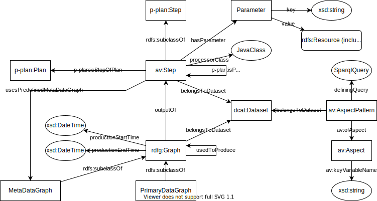
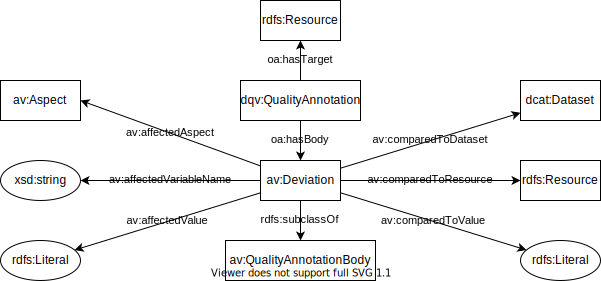
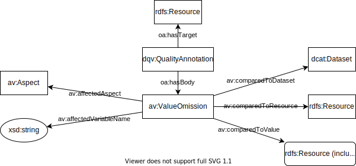
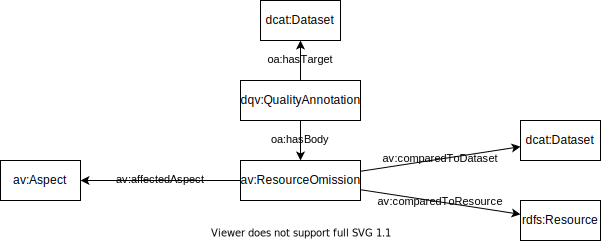
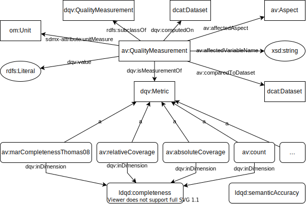
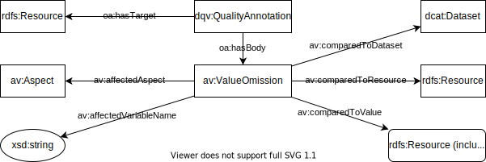
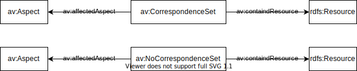

# The ABECTO Vocabulary

The ABECTO Vocabulary (AV) is a vocabulary for the description of execution plans and results of the [ABox Evaluation and Comparison Tool for Ontologies (ABECTO)](https://github.com/fusion-jena/abecto). It reuses …

## Scope of the Vocabulary

The vocabulary is designed to cover the following competency questions.

### Execution Plan

* What are the steps of an execution plan and which steps follow each other in which sequence?
* What is the executing Java class of a step, what are their call parameters and which predefined meta data graph will be used?
* To which dataset belong the resulting primary data of a step?

### Primary Data Graph and Meta Data Graph

  * To which dataset belongs a primary data graph or meta data graph?
  * Which step produced some primary data graph or meta data graph in which time interval and which other data graphs have been used to produces them?

### Aspect

* Which are the aspects of interest?
* What is the key variable of an aspect?
* How is an aspect modeled in a specific dataset?

### Resource Correspondence

* Which resources correspond to each other?
* Which resources are known to not correspond to each other?

### Quality Data

* What object property or data property values of which resource in a dataset are known to be wrong?
* What data property values of which corresponding resources of two dataset deviate?
* What object property values of which corresponding resources that concern the same aspect and of two datasets do not correspond to each other?
* Which further issues have been found for a dataset?
* For which resources in a dataset does no corresponding resource exist in another dataset?
* Which measurements have been measured for a dataset with which parameters?

## Model

Plan Execution



Deviations



Value Omissions



Resource Omissions



Quality Measurements



Issues



Correspondences



```turtle
[ a av:CorrespondanceSet ;
  av:containdResource x:qwe, x:sdf, y:sdfs, z:hfg ;
  av:affectedAspect :someAspect ]
[ a av:NoCorrespondanceSet ;
  av:containdResource x:qwe, x:sdf, y:sdfs, z:hfg ;
  av:affectedAspect :someAspect ]
```


### Related Vocabularies (Re-Use Candidates)

* Ontology Quality
    * dqv 	http://www.w3.org/ns/dqv#    https://www.w3.org/ns/dqv.ttl   https://www.w3.org/TR/vocab-dqv/
    * daq 	http://purl.org/eis/vocab/daq#
    * dcat 	http://www.w3.org/ns/dcat#
    * dcterms 	http://purl.org/dc/terms/
    * duv 	http://www.w3.org/ns/duv#
    * oa 	http://www.w3.org/ns/oa#
    * prov 	http://www.w3.org/ns/prov#
    * sdmx-attribute 	http://purl.org/linked-data/sdmx/2009/attribute#
    * skos 	http://www.w3.org/2004/02/skos/core#
* Ontology Mapping
    * https://moex.gitlabpages.inria.fr/alignapi/format.html
* Categories
     * http://www.linkedmodel.org/schema/vaem#Domain
     * http://purl.org/cwmo/#KnowledgeDomain

Pipelines / Processes
* CTRLont   https://technicalbuildingsystems.github.io/Ontologies/CTRLont/index-en.html
* Machine Learning Schema   http://www.w3.org/ns/mls
* http://ontologydesignpatterns.org/wiki/Community:Workflow
* P-Plan     http://vocab.linkeddata.es/p-plan/index.html#Plan (looks good)
* prov-o
  * https://www.w3.org/TR/prov-o/#SoftwareAgent (for Nodes)
  * https://www.w3.org/TR/prov-o/#Activity (for node results)
  * https://www.w3.org/TR/prov-o/#wasInformedBy (for dependencies between results)

* Provenance and Metadata

* SPARQL Query Datatype

    * https://www.w3.org/TR/shacl/#sparql-constraints just uses String

* Measurements

    * ```
      @prefix sdmx-attribute:  <http://purl.org/linked-data/sdmx/2009/attribute#> .
      ```

* https://www.w3.org/TR/vocab-dqv/#dqv:QualityAnnotation requires  [oa:motivatedBy](https://www.w3.org/TR/2016/CR-annotation-vocab-20160705/#motivatedby) statement

## Open Questions

###### What term to use for a set of resources in corresponding classes of different ontologies?

There will be a set of variables/attributes for each ??? and a defining SPARQL Query with regards to an specific ontology. Candidates:

* ~~Class~~ - already occupied by common SW terminology (`rdfs:class` / `owl:class`)
* ~~Category~~ - already occupied by common quality assurance terminology (group of  multiple quality dimensions)
* **Aspect** - my current favorite; two notable usages of the Term in vocabularies, both for similarly-shaped concerns:
  * http://www.linkedmodel.org/schema/vaem#Aspect
  * https://schema.org/reviewAspect
* Scope - is more concerned with visibility than belonging
* Domain - also describes parts of an URL ⊆ IRI; sounds to broad
* Area - as in "research area", but this sounds to broad
* ~~Field~~ - as in "research field", but this sounds to broad
* Concept - term use in [SKOS](https://www.w3.org/2009/08/skos-reference/skos.html) with high flexibility in meaning, but I would need a own resource, therefore "already occupied"
* Type - might be mixed up with data types or `rdf:type`, but that is not a show stopper
* Entity Type - term known from Entity-Relationship-Models
* Schema Set/Group - 
* Relation - as known from databases, but might be mixed up with "association" or "property"
* Shape Set/Group - term known from [SHACL](https://www.w3.org/TR/shacl/), but might cause confusion
* Pattern Set/Group - technical description, but does not help to understand the semantic
* Facet - synonym of aspect[¹](https://en.wiktionary.org/wiki/aspect),
* Feature
* Viewpoint

## Other interesting resources
* https://iswc2017.semanticweb.org/wp-content/uploads/papers/PostersDemos/paper565.pdf
* http://dgarijo.github.io/Widoco/doc/bestPractices/index-en.html

# Acknowledgements

Thanks to [Alsayed Algergawy](https://orcid.org/0000-0002-8550-4720) and [Sheeba Samuel](https://orcid.org/0000-0002-7981-8504) for suggestions of vocabulary to reuse.
