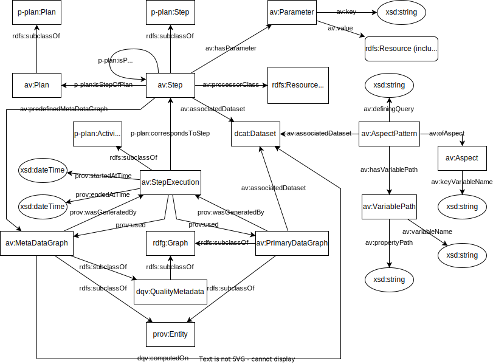
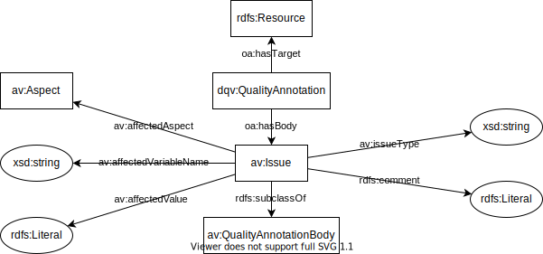
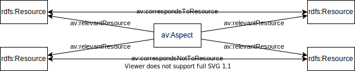

# The ABECTO Vocabulary

The ABECTO Vocabulary (AV) is a vocabulary for the description of execution plans and results of the [ABox Evaluation and Comparison Tool for Ontologies (ABECTO)](https://github.com/fusion-jena/abecto).

## Scope of the Vocabulary

The vocabulary is designed to cover the following competency questions.

### Execution Plan

* What are the steps of an execution plan and which steps follow each other in which sequence?
* What is the executing Java class of a step, what are its call parameters and which predefined meta data graphs will be used?
* Which dataset will the resulting primary data of a step belong to?

### Primary Data Graph and Meta Data Graph

  * Which dataset does a primary data graph or meta data graph belong to?
  * Which step produced some primary data graph or meta data graph in which time interval and which other data graphs have been used to produce them?

### Aspect

* Which are the aspects of interest?
* What is the key variable of an aspect?
* How is an aspect modeled in a specific dataset?

### Resource Correspondence

* Which resources correspond to each other?
* Which resources are known to not correspond to each other?

### Quality Data

* What object property or data property values of which resource in a dataset are known to be wrong?
* What data property values of which corresponding resources of two dataset deviate?
* What object property values of which corresponding resources that concern the same aspect and of two datasets do not correspond to each other?
* Which further issues have been found for a dataset?
* For which resources in a dataset does no corresponding resource exist in another dataset?
* Which measurements have been measured for a dataset with which parameters?

## Model

The vocabulary is intended to be used in set of graphs. The main graph contains a description of the execution plan for ABECTO and the aspects of interest for comparison. The execution results will be stored in several result graphs which might be associated to a dataset:

* Primary Data Graphs for dataset import and transformation results. The content and used vocabulary is completely up to the dataset creators.

* Meta Data Graphs for matching, comparison, and evaluation results. The results will be represented using this vocabulary.

After execution, the main graph will further contain provenance information about the execution and the result graphs.



**Deviations** should be represented inside a meta data graph using the following schema:


**Value Omissions** should be represented inside a meta data graph using the following schema:


**Resource Omissions** should be represented inside a meta data graph using the following schema:


**Quality Measurements** should be represented inside a meta data graph using the following schema:


Custom **issues** should be represented inside a meta data graph using the following schema:



**Correspondences** and **incorrespondences** should be represented inside a meta data graph using the following schema:



```turtle
ex2:bill av:correspondsToResource ex2:william, ex3:william, ex4:bill .
ex1:people av:relevantResource ex2:bill, ex2:william, ex3:william, ex4:bill .
```
```turtle
ex2:anna av:correspondsNotToResource ex3:anne .
ex1:people av:relevantResource ex2:anna, ex3:anne .
```

The reuse of `owl:sameAs`, `owl:equivalentClass`, `owl:differentFrom`, `owl:disjointWith`, and `owl:AllDisjointClasses` was rejected due to the following reasons:
* Different representations of equivalent concepts might be logically incompatible.
* Different representations of resources for one aspect might be individuals in one dataset and classes in another dataset.

The reuse of `skos:exactMatch` was rejected due to the following reasons:

* It should only be used to link concepts from different datasets (see [SKOS Reference](https://www.w3.org/TR/skos-reference/#L4160)).

The reuse of the [Alignment API format](https://moex.gitlabpages.inria.fr/alignapi/format.html) vocabulary and [EDOLA](http://ns.inria.org/edoal/1.0/) vocabulary was rejected due to the following reasons:
* It is focused on the representation of alignments of exactly two datasets, each represented by exactly one file source.

# Acknowledgements

Thanks to [Alsayed Algergawy](https://orcid.org/0000-0002-8550-4720) and [Sheeba Samuel](https://orcid.org/0000-0002-7981-8504) for feedback on earlier drafts of the ABECTO vocabulary and suggestions of other vocabulary to reuse.
